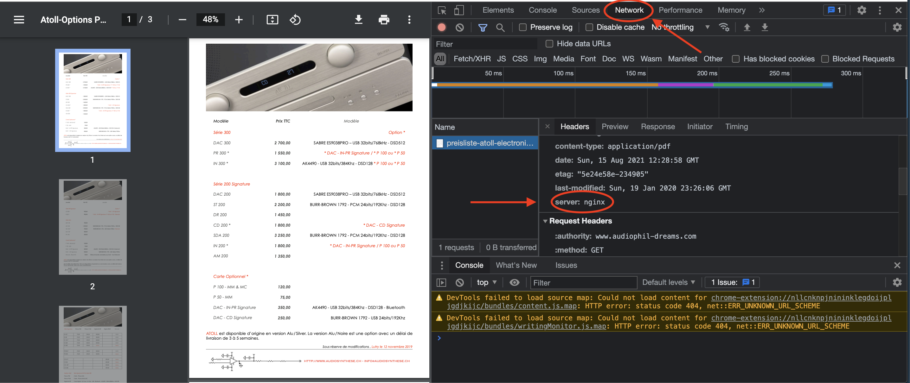
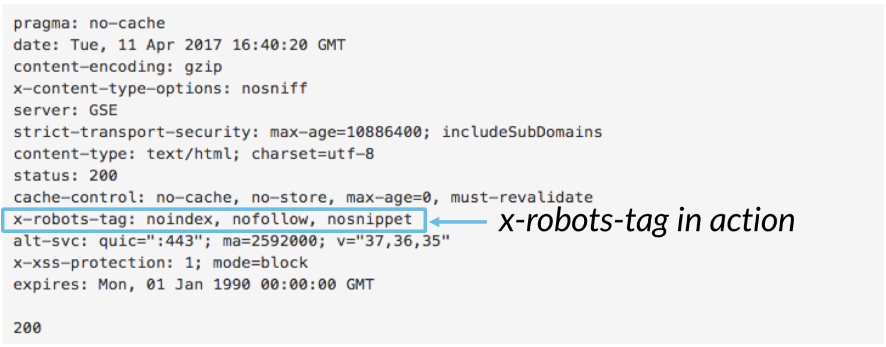

# SEO

Für die Webseiten-Indexierung innerhalb der Google-Suchmaschine ist es von grösster Bedeutung, dass du die Kunst des *Seo* (Search Engine Optimization) beherrschts.

## Outline

Das Wichtigste, damit deine Webseite auf dem Internet effizient in der Google-Suche gefunden wird - idealerweise auf `#1` - ist eine **"korrekte" HTML-Struktur (= _Outline_)** zu haben. 

- **Seite, um dein aktuelles Outline zu checken**: https://gsnedders.html5.org/outliner/


### Wenn dein Outline "falsch" ist

Falls du nicht zufrieden bist mit deinem aktuellen Outline, dann empfehle ich dir die folgende Methode: https://www.youtube.com/watch?v=QDq-KVE5ZSA

## PDFs

Ein PDF wird von Google grundsätzlich automatisch in die Suchmaschine aufgenommen. Oftmals verwendest du PDFs jedoch als Ergänzungen zu den 

- Type in the following into you `.htaccess`-File, **for Appache-Servers**:

```
<Files ~ "\.pdf$">
  Header set X-Robots-Tag "noindex, nofollow"
</Files>
```

- If you have **NGINX**, you need this code instead:

```
location ~* \.pdf$ {
  add_header X-Robots-Tag "noindex, nofollow";
}
```

To check if it worked, you need to view the `HTTP Header` of your PDF. You can do this via the *developer tools* in the Google Chrome Browser (by hitting `F12`). 



For a more precise explanation, I recommend [this site](https://mkyong.com/computer-tips/how-to-view-http-headers-in-google-chrome/).



- If the solution above does not work, I have found an alternative way:

```
<FilesMatch ".pdf$">
  Header set X-Robots-Tag "noindex, nofollow"
</FilesMatch>
```

- Quelle: (Google Developers, Teil 1)[https://developers.google.com/search/docs/advanced/robots/robots_meta_tag]

> How can I prevent my PDF files from appearing in search results; or if they already do, how can I remove them?

The simplest way to prevent PDF documents from appearing in search results is to add an X-Robots-Tag: `noindex` in the HTTP header used to serve the file. If they're already indexed, they'll drop out over time if you use the X-Robot-Tag with the `noindex` directive. For faster removals, you can use the URL removal tool in Google Webmaster Tools.

- Quelle: [Google-Developers, Teil 2](https://developers.google.com/search/blog/2011/09/pdfs-in-google-search-results#:~:text=Q%3A%20How%20can%20I%20prevent,used%20to%20serve%20the%20file.)

